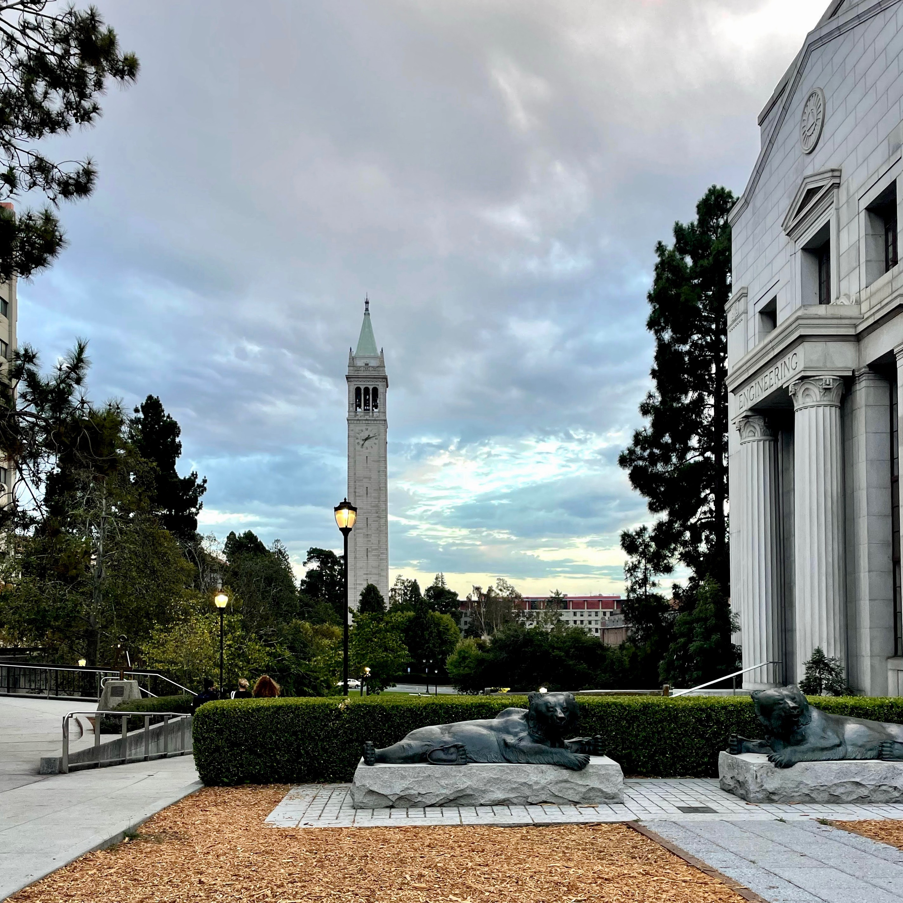
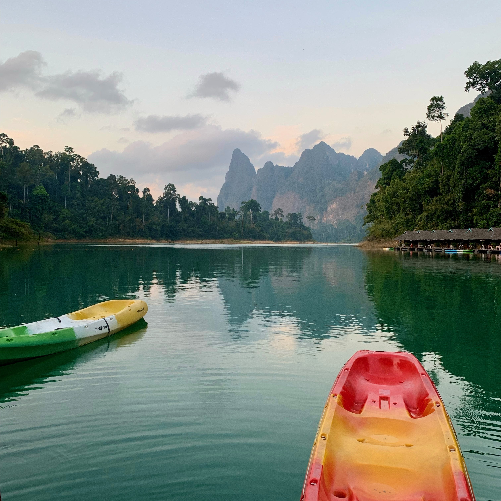

  <h1>About Me</h1>

Hello! I’m Zoe. I grew up in the Bay Area in Northern California and studied astrophysics and data science at UC Berkeley. After graduating in 2023, I spent an incredible year teaching English in Kalasin, Thailand with a Fulbright Scholarship, which I documented through a <a href="https://zoeko555.wixsite.com/zoeko" target="_blank">personal blog</a>—easily one of my most challenging and fulfilling experiences. Now, I am a PhD student at Johns Hopkins University in Baltimore, Maryland, where I spend my non-science hours outdoors on my bike or on a run or in the gym training jiu jitsu. 

  

    
    
Berkeley, California,

  

  

    
    
Surat Thani, Thailand,

  

  

    
    
Baltimore, Maryland,

  

