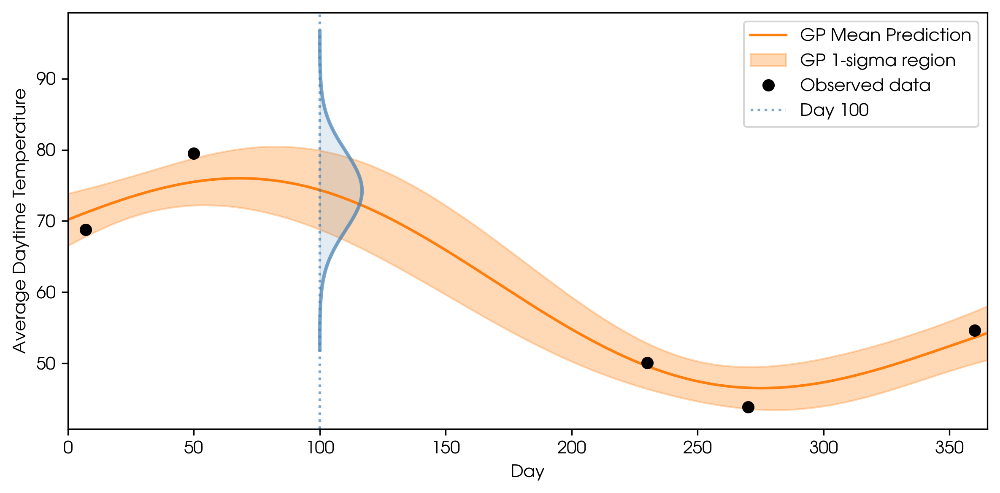
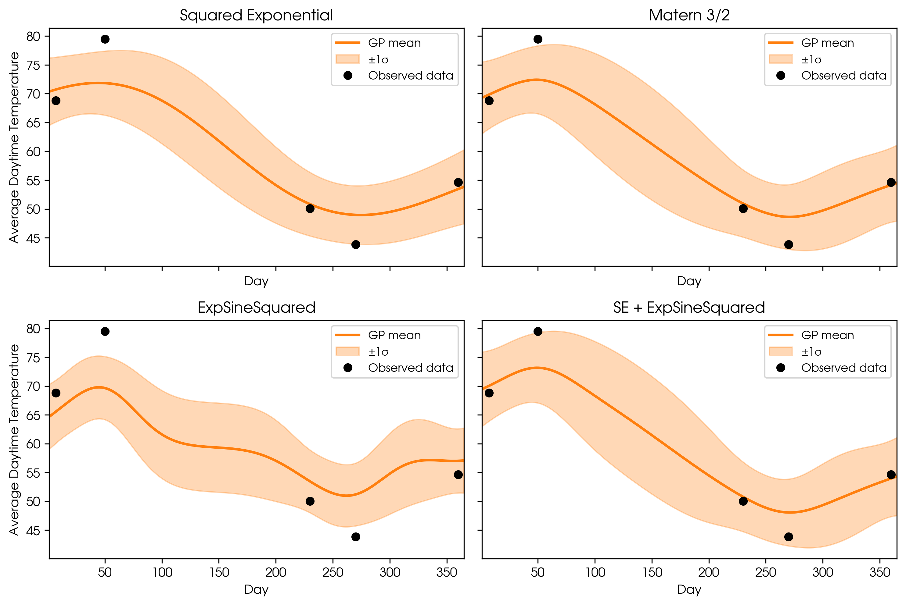
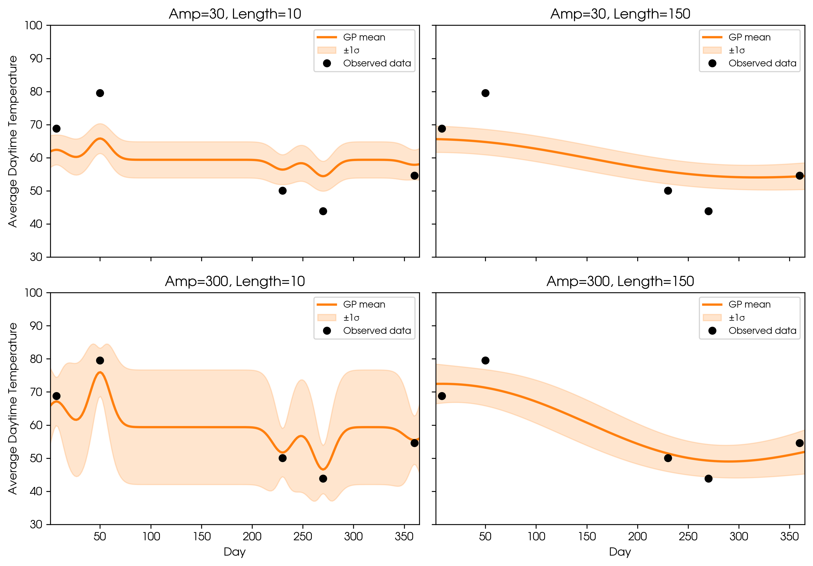

# Gaussian Processes: A Toy Example

When I started learning about Gaussian Processes (GPs), an endeavor still in progress, I came across various definitions, some of which were intuitive:

> “A Gaussian process model describes a probability distribution over possible functions that fit a set of points.”
> <small><a href="https://arxiv.org/html/2009.10862v5" target="_blank">Source</a></small>

Others were more technical:

> “A Gaussian process is a collection of random variables, any finite number of which have a joint Gaussian distribution.”
> <small><a href="https://gaussianprocess.org/gpml/chapters/RW.pdf" target="_blank">Source</a></small>

Gaussian Processes are powerful modeling tools. What helped me most was seeing a GP in practice with actual data. In this post, I’ll walk through a simple toy example using the [tinygp library](https://tinygp.readthedocs.io/en/stable). You can find the notebook I used for all the figures [here](https://github.com/zoekko).

## Motivation: Why use a Gaussian Process?

Suppose you’ve collected a set of observations—maybe the daily temperature, stock prices, or (in my case) a measure of how stellar surfaces vary over time. For this example, let’s stick with temperature over time.

Imagine you’ve collected a few discrete observations. Maybe you now want to predict tomorrow’s temperature. Or maybe there’s a day in the past with missing data, and you want to estimate the temperature for that day.

  

This is a classic regression problem: given observed data, how can you predict values for new inputs?

## How Gaussian Processes Help

GPs allow you to model relationships between your inputs (like days) and outputs (like temperature) without having to choose a specific functional form. Unlike fitting a straight line or a polynomial to your data (where you pre-choose a formula), GPs infer a distribution over possible functions that could explain your data, capturing both **predictions** and **uncertainty**.

**Key feature:** GPs don’t just output a single prediction. They also provide an uncertainty estimate, so you know how confident you are about each prediction. There’s a big difference between predicting that tomorrow’s temperature will be 70° ± 5°, or 70° ± 50°!

## A Toy Example: GPs to Predict Temperature

Now let’s run a GP regression on the fake temperature data. I used the **Squared Exponential kernel**—which determines how smooth or wiggly the predicted function is.

  

The GP prediction fits the data perfectly at observed points, with zero uncertainty (assuming perfect measurements). As you move further away from observed points, the uncertainty (shaded region) increases. If observations are made close together, there’s less uncertainty between them.

But in real life, measurement error exists, so let’s add in some error bars to the observations and update the fit.

  

GP fit incorporating observational errors looks more realistic. Now, the fitted GP lets us **interpolate** (estimate between known data) or **extrapolate** (predict beyond the data range), and crucially, tells us how much we can trust each prediction. For example, the temperature on Day 100 is predicted to be 74.3° ± 5.6°. If you predict far beyond the last observation, uncertainty increases, reflecting our lack of information.

And that’s an example of how GPs can be used in regression: **Given noisy, sparse data, GPs flexibly fit and quantify your uncertainty everywhere.**

## How does this all actually work?

Let’s revisit the technical definition:

> “A Gaussian process is a collection of random variables, any finite number of which have a joint Gaussian distribution.”

**A random variable** is simply a quantity whose outcome is uncertain, like the result of a dice roll. Let’s see how this relates to our GP: We can take a slice through the GP at day 100 and just look at the spread of predicted temperature for that day.

  
  

Marginal distribution: a familiar 1-D Gaussian (bell curve). This curve is described by two values: a mean (most likely temperature) and standard deviation (uncertainty).

  

Two marginal distributions: the temperature on day 100 and day 150. Now we have a collection of random variables: the temperature for each day. The GP is a collection of these random variables.

**Now, the second part of the definition:**

> “…any finite number of which have a joint Gaussian distribution.”

If we plot the predicted temperatures for day 100 and day 150 as a joint distribution, we get a 2D Gaussian:

  

Joint distribution: every pair of GP predictions is jointly Gaussian. This extends to higher dimensions too: any finite set of random variables in a GP is jointly Gaussian. In other words, a GP is an infinite-dimensional generalization of a Gaussian distribution. Every possible input is a random variable, and sets of those random variables are jointly Gaussian.

## Components of a GP

While a single Gaussian is defined by a mean and standard deviation, a GP is defined by a **mean function** and a **covariance matrix**.

Mean function: The predicted value for every possible input. (For my weather example, I set this as the average observed temperature.)

Covariance matrix: Each pair of points has a quantified correlation—how much knowing one value helps you predict the other. For example, in weather data, day 3 and day 4 are highly correlated, but day 3 and day 100 are not.

## Choosing the right GP kernel

The **kernel** (covariance function) governs these correlations. It encodes your assumptions about how the data should behave: how correlated points should be, how smooth or wiggly the function might be, and whether there are underlying patterns like seasonality.

* **Squared Exponential (SE):** Assumes outputs are similar for nearby inputs; favors smooth, gradual changes.
* **Matern 3/2:** Allows for less smoothness (more roughness) in the fitted curve.
* **ExpSineSquared:** Models repeating, periodic patterns.
* **SE + ExpSineSquared (Composite):** Combines smooth trends with periodic/seasonal patterns.

  

**Takeaway:** Your kernel choice is crucial—it tells the GP what kind of structure to expect in your data. Choose wisely!

## Kernel Hyperparameters: Amplitude & Length Scale

Once you’ve chosen your kernel, you need to set its **hyperparameters**:

Amplitude: Controls how much the function can vary vertically. Larger amplitude means the GP expects bigger changes.

Length scale: Controls how quickly the function can change. Small length scales let the GP fit rapid changes; large length scales create smoother functions.

  

Typically, these hyperparameters are **fit to the data** to avoid underfitting or overfitting, using techniques like maximizing marginal likelihood or Bayesian model comparison (metrics like Bayesian Evidence).

## Takeaway

**Gaussian Processes are flexible, uncertainty-aware tools for regression and more:**

* They let you fit functions without needing to specify a fixed formula.
* They always provide meaningful confidence estimates for every prediction.
* Your choice of kernel and hyperparameters encodes your assumptions about the data—which makes GPs both powerful and expressive.

Choose kernels and hyperparameters with care, fit them thoughtfully, and your GP can give robust, honest predictions even in complex, noisy scenarios.
