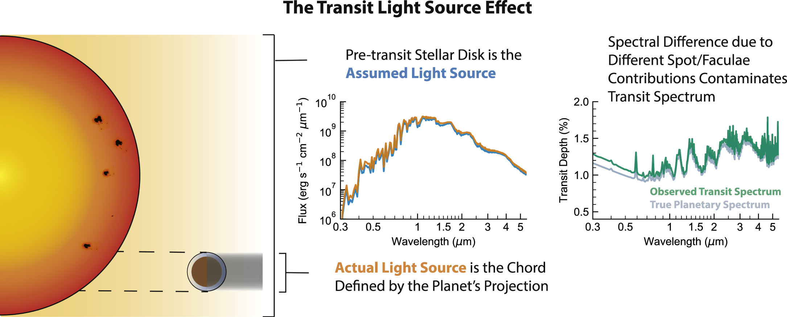

# Research

**My current research focuses on developing statistical methods to effectively mitigate stellar contamination in transmission spectroscopy, opening the door to more accurate characterization of exoplanetary atmospheres.**
  
Since the launch of NASA’s James Webb Space Telescope (JWST), the field of exoplanet atmosphere characterization has made remarkable advances. Transmission spectroscopy now allows astronomers to detect molecules and clouds on distant worlds, offering insights into planet formation and migration.

  
  
Source: NASA

However, this process is complicated by stellar contamination—variability and heterogeneities like spots on the host star, which can mimic or obscure the signals from exoplanet atmospheres. Physical models used to correct for this are frequently oversimplified, while more accurate, physics-based models are currently too computationally demanding to use broadly.

  
  
Source: Rackham, Benjamin V., Dániel Apai, and Mark S. Giampapa. "The transit light source effect: false spectral features and incorrect densities for M-dwarf transiting planets." The Astrophysical Journal 853.2 (2018): 122

My current work aims to overcome these challenges by **implementing Gaussian Processes into the atmospheric retrieval pipeline.** Rather than relying solely on physical models, **I am developing a flexible, data-driven framework that can effectively model the unknown and complex stellar signals present in transmission spectra.** Gaussian Processes are flexible statistical models that can capture complex patterns in data without assuming a specific form, making them a powerful tool to characterize stellar noise in transmission spectra.

As a test case, I apply this GP-aided framework to study a giant planet orbiting a small, highly variable M dwarf. **Ultimately, the goal of my current work is to push the boundaries of exoplanet atmospheric characterization by implementing novel statistical frameworks that can robustly disentangle planetary signals from stellar contamination.**

*Results coming soon.*

